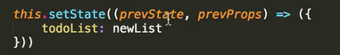

1. react 前期:

   Html5, Css, ES5, ES6, JS, Webpack,Node

2. react 使用 ES6 进行开发

3. vue 的脚手架：

   vue-cli

4. 搭建 react 开发环境

   ```sh
   create-react-app
   npm install -g create-react-app
   create-react-app my-app
   cd my-app
   npm start
   ```

   脚手架所包含的三部分：
   package manager：包管理工具---npm
   bundler：打包工具，webpack
   compiler：编译器，babel，react

5. react 入口文件：

   index.js
   引入 react，react-dom（react 编译器），引入 app.js 这个组件
   react 对应的根组件就是 app.js，进行页面的渲染。

6. 使用 react.app 创建 hello world
7. react 中也有自己的模板系统
8. render 函数:

   必须有 return（），一定要返回一个 JSX 的对象。
   是一个生命周期函数，当数据发生改变的时候
   render 函数的返回结果决定了页面到底要显示什么。

9. JSX 的语法:
   只要用 JSX 语句，必须用{ }括起来
   先被解析成 createElem 方法
   再被解析成虚拟 dom
   然后最终解析成真实的 dom 节点
   语法简介：
   定义标签时，只允许被一个标签包裹。标签一定要闭合。
   元素类型：小写首字母对应 DOM 元素，大写首字母对应组件元素，注释使用 js 注释方法。
   元素属性
   class 属性改为 className
   for 属性改为 htmlFor
   Boolean 属性：省略 Boolean 属性值会导致 JSX 认为 bool 值设为了 true
   JavaScript 属性表达式，属性值要使用表达式，只要用 {} 。{}是一个 js 的表达式，也就是说这里不仅可以写变量，也可以写表达式。
   HTML 转义：React 会将所有要显示到 DOM 的字符串转义，防止 XSS。后台传过来的数据带页面标签的是不能直接转义的，具体转义的写法如下：
   ```jsx
   var content = '<strong>content</strong>'
   React.render(
     <div dangerouslySetInnerHTML={{ __html: content }} />,
     document.body
   )
   ```
10. 编写 react ToDoList
11. 组件：页面上的一部分
    模块：通过 module.exports 导出
12. react 的简介：
    声明式设计 −React 采用声明范式，可以轻松描述应用。声明式是告诉计算机要去做什么而不管怎么做，而命令式是要描述如何去做。
    高效 −React 通过对 DOM 的模拟(虚拟 dom)，最大限度地减少与 DOM 的交互。
    灵活 −React 可以与已知的库或框架很好地配合。
    JSX − JSX 是 JavaScript 语法的扩展。(对比模版引擎)
    组件 − 通过 React 构建组件，使得代码更加容易得到复用，能够很好的应用在大项目的开发中。
    单向响应的数据流 − React 实现了单向响应的数据流，这也是它为什么比传统数据绑定更简单。
13. react 是一个轻量级的视图层框架，需要引入 Flux、Redux 混合使用解决数据和前段视图层的问题。数据驱动的框架，无法实现数据量较大的项目。
14. 虚拟 dom：虚拟 dom 是一个真实 dom 的一个 js 对象的映射。
15. 函数式编程：主要思想是把运算过程尽量写成一系列嵌套的函数调用。
16. 组件和元素的区别：
    元素是由组件生成的
    组件首字母大写，标签是小写
17. 生命周期函数：
    constructor（）：构造器，在组件创建的一瞬间最先被执行的，初始化数据。函数作用域的绑定一定要放在 constructor 里面来写，这样每一次传给子组件方法的引用是固定的，子组件就不会因为这个方法做重新渲染。
    render（）：渲染页面
    componentDidMount（）：组件挂载到页面之后执行
18. 如何区分一个网页是前段渲染的还是后端拍出来的？
    源代码上有的就是后端拍出来的
    源代码上没有的内容就是前端异步渲染的内容
19. 父子组件之间的传值：
    react 中父组件给子组件传值通过属性的形式来进行传递。
    子组件通过 this.props.value 来使用
    react 子组件怎么给父组件传值：
    子组件调用父组件传过来的方法，来给父组件进行传值
20. render 函数什么时候会重新渲染？
    当 state 发生改变的时候（调用一个方法叫做 setState（））
    当 props 发生改变的时候 render 函数会重新执行。
21. setState（），是一个异步的操作，不仅可以写对象还可以写函数。

    

    

22) react 事件绑定的语法和原生事件绑定没有一点关系。
23) 事件代理的好处：
    提高性能
    动态增加的元素无需再绑定事件
24) propTypes：

    用来帮助我们对接收的属性值做校验
    定义一些子组件的默认值。
    如果报错发生警告不会影响代码的执行。

    默认值：

    

    规范：

    

25) 使用 fillder 里面的 AutoResponder 来帮我们实现本地数据的模拟。

26) 安装一个插件：react developer tools
    线上环境和开发环境的区别：
    红色代表开发环境，蓝色代表线上环境
    开发环境有压缩，线上环境没有压缩
    打包线上环境代码的时候，需要引入一个 webpack 的插件，这个插件是 react 官方提供的，我们可以直接拿来使用。
27) axios 不支持 IE，IE9，IE10 都不支持

    ajax 请求：axios、fetch

    ```sh
    yarn add axios
    yarn add whatwg-fetch
    npm install whatwg-fetch --save
    ```
